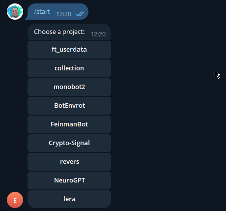
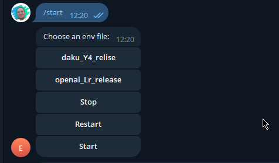
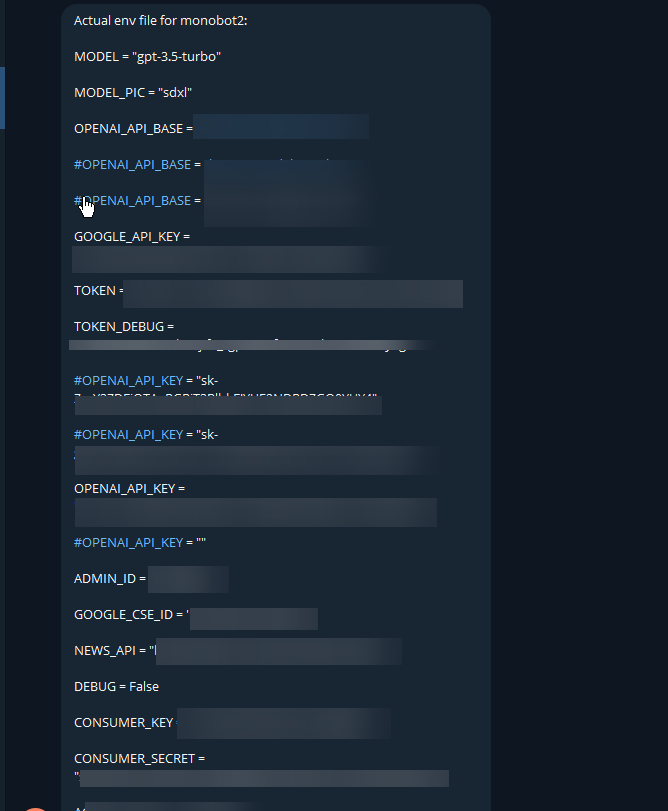

# Управление Docker-контейнерами через Telegram-бота

## Описание

Этот проект представляет собой Telegram-бота для управления Docker-контейнерами. Бот позволяет запускать, останавливать и перезапускать контейнеры, а также менять их конфигурацию на лету.

## Особенности

- Асинхронное программирование для эффективного взаимодействия с Telegram API и Docker.
- Поддержка множества проектов и конфигураций.
- Логгирование всех ключевых действий и исключений.
- Безопасность: доступ ограничен только для администратора.

## Требования

- Python 3.8+
- Docker
- Telegram Bot API Token
- Переменные окружения (см. раздел "Конфигурация")

На самом деле данное решение не будет работать в докер-контейнере, упаковал в него я по привычке, запускать его нужно естественно в среде самого сервера, где есть доступ к докеру, который запускает ваши контейнеры.

Можно делать это скриптом, который будет запускать бота в фоне:

```bash
#!/bin/bash
pkill -f -e botenv.py
rm -rf __pycache__
rm -rf botenv.log
nohup python3 botenv.py >> botenv.log 2>&1 &
disown
```


## Конфигурация

Переменные окружения задаются в файле `.env`:

- `BOT_API_TOKEN`: Токен Telegram-бота
- `ADMIN_ID`: ID администратора в Telegram
- `PROJECT_DIR`: Директория с Docker-проектами
- `ENV_DIR`: Директория с файлами окружения для Docker-контейнеров
- `DEBUG`: Флаг для активации режима отладки (опционально)

## Установка

1. Клонировать репозиторий:

    ```bash
    git clone https://github.com/omeh2003/BotEnvrot.git
    ```

2. Установить зависимости:

    ```bash
    pip install -r requirements.txt
    ```

3. Заполнить `.env` файл согласно шаблону.

4. Запустить бота:

    ```bash
    python botenv.py
    ```

## Использование

1. Отправьте команду `/start` боту в Telegram.
2. Выберите проект из предложенного списка.
3. Выберите файл окружения или выполните другую команду (остановить, перезапустить).

## Возможные улучшения

- Ведется разработка обратки webhook-сообщений от Github, для автоматического обновления проектов после сборки в Github Actions.
- Более надежный механизм работы с докер композом.


## Лицензия

MIT

## Screenshots:

[](img.png)

[](img_1.png)

[](img_2.png)

---
